# ShopNow — End-to-End CI/CD on AWS EKS

> A production-grade MERN e-commerce application deployed via a fully automated Jenkins pipeline on Amazon EKS — from `git push` to a live, monitored deployment with zero manual infrastructure steps.

[](https://www.terraform.io/)
[](https://www.ansible.com/)
[](https://www.jenkins.io/)
[](https://www.docker.com/)
[](https://kubernetes.io/)
[](https://aws.amazon.com/)
[](https://prometheus.io/)
[](https://grafana.com/)

---

## Table of Contents

- [Overview](#overview)
- [Architecture](#architecture)
- [Tech Stack](#tech-stack)
- [Repository Structure](#repository-structure)
- [Prerequisites](#prerequisites)
- [Quick Start](#quick-start)
- [Sprint Breakdown](#sprint-breakdown)
  - [Sprint 1 — Application Containerization](#sprint-1--application-containerization)
  - [Sprint 2 — Infrastructure as Code (Terraform)](#sprint-2--infrastructure-as-code-terraform)
  - [Sprint 3 — Configuration Management (Ansible)](#sprint-3--configuration-management-ansible)
  - [Sprint 4 — Kubernetes Deployment](#sprint-4--kubernetes-deployment)
  - [Sprint 5 — Monitoring & Observability](#sprint-5--monitoring--observability)
- [CI/CD Pipeline (All 15 Stages)](#cicd-pipeline-all-15-stages)
- [Kubernetes Workloads](#kubernetes-workloads)
- [Monitoring & Observability](#monitoring--observability)
- [Issues & Fixes](#issues--fixes)
- [Author](#author)

---

## Overview

**ShopNow** demonstrates the complete DevOps lifecycle — source control, infrastructure provisioning, configuration management, Docker image builds, Kubernetes deployment, and real-time observability — all wired into a single reproducible Jenkins pipeline.

**Live application running on AWS EKS via Classic ELB:**

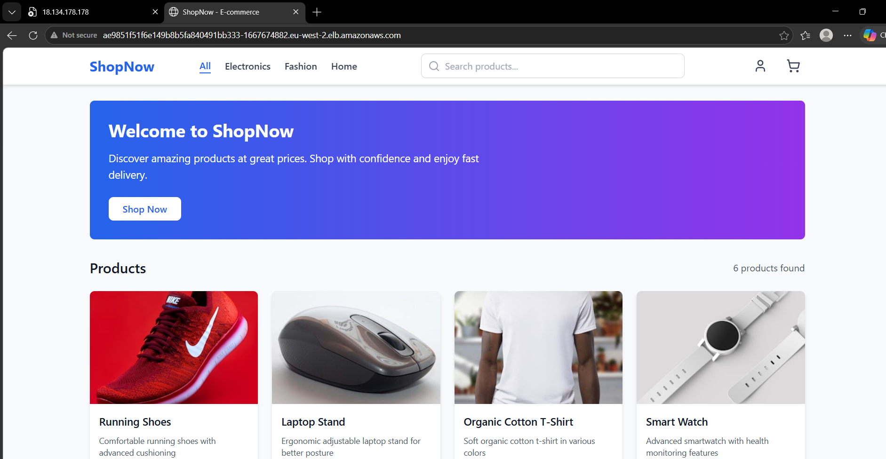

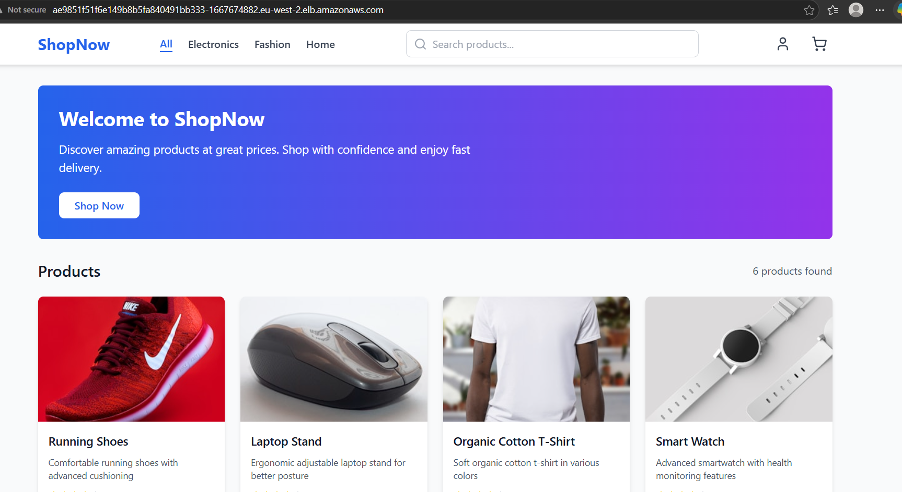

Every `git push` to `main` triggers a pipeline that:

1. **Builds** multi-stage Docker images for `frontend`, `backend`, and `admin` and pushes them to **Amazon ECR**
2. **Provisions** AWS infrastructure (VPC, EKS, IAM, ECR, EC2) with **Terraform** backed by S3 + DynamoDB
3. **Configures** the Jenkins node with **Ansible** (Docker, kubectl, AWS CLI, Helm)
4. **Deploys** all workloads to **Amazon EKS** via `kubectl apply`
5. **Verifies** the rollout with health checks and a smoke test against the Load Balancer URL
6. **Monitors** with **Prometheus** (metrics scraping) and **Grafana** (dashboards)
7. **Rolls back** all three deployments automatically on pipeline failure

---

## Architecture

```
  Developer
     │  git push
     ▼
  GitHub ──── webhook ────► Jenkins EC2 (18.134.178.178:8080)
                                    │
              ┌─────────────────────┼──────────────────────┐
              │                     │                      │
         Terraform              Ansible               Docker Build
      (VPC, EKS, IAM,       (kubectl, awscli,      (frontend, backend,
       ECR, S3, DynamoDB)     Helm, Terraform)          admin)
                                                          │
                                                    docker push
                                                          │
                              ╔═══════════════════════════▼═══════════════╗
                              ║        AWS  eu-west-2                     ║
                              ║                                           ║
                              ║  Amazon ECR                               ║
                              ║  975050024946.dkr.ecr.eu-west-2           ║
                              ║  ├── shopnow-backend                      ║
                              ║  ├── shopnow-frontend                     ║
                              ║  └── shopnow-admin                        ║
                              ║                                           ║
                              ║  VPC  10.0.0.0/16  (eu-west-2a/2b)       ║
                              ║  └── EKS Cluster: shopnow-eks (v1.31)     ║
                              ║       ├── Namespace: shopnow              ║
                              ║       │   ├── frontend   (2 replicas)     ║
                              ║       │   ├── backend    (2 replicas)     ║
                              ║       │   ├── admin      (2 replicas)     ║
                              ║       │   ├── mongodb    (StatefulSet)    ║
                              ║       │   ├── prometheus (metrics)        ║
                              ║       │   └── grafana    (dashboards)     ║
                              ║       └── Node Group: 2× t3.medium        ║
                              ║                                           ║
                              ║  Classic ELB ◄── frontend-service         ║
                              ╚═══════════════════════════════════════════╝
```

---

## Tech Stack

| Layer | Technology | Details |
|---|---|---|
| **Cloud** | AWS (eu-west-2) | VPC, EKS, ECR, EC2, S3, DynamoDB, ELB |
| **IaC** | Terraform ≥ 1.6 | Flat file structure, S3 remote state + DynamoDB locking |
| **Config Mgmt** | Ansible | 3 playbooks: install deps, configure EKS, deploy monitoring |
| **CI/CD** | Jenkins (EC2 t3.medium) | Declarative pipeline, 15 stages, AWS credentials binding |
| **Containers** | Docker multi-stage | Node 18 Alpine build → Nginx Alpine runtime |
| **Orchestration** | Kubernetes (EKS 1.31) | Deployments, StatefulSet, HPA, ConfigMap, Secrets |
| **Frontend** | React + Nginx | Served under `/aryan/` sub-path via nginx rewrite |
| **Backend** | Node.js / Express | REST API on port 5000, `/api/health` endpoint |
| **Database** | MongoDB 6.0 | StatefulSet with headless service, emptyDir storage |
| **Registry** | Amazon ECR | shopnow-backend, shopnow-frontend, shopnow-admin |
| **Monitoring** | Prometheus + Grafana | ClusterRole RBAC, 15d retention, pod annotation scraping |
| **Autoscaling** | HPA (autoscaling/v2) | CPU + Memory metrics, scale-up/down stabilization |

---

## Repository Structure

All infrastructure, configuration, and application code lives on the `main` branch:

```
shopNow/
├── frontend/                        # React SPA
│   ├── Dockerfile                   # Multi-stage: Node 18 build → Nginx Alpine
│   ├── nginx/
│   │   └── default.conf             # /aryan/ rewrite + /aryan/api/ proxy
│   └── src/
├── backend/                         # Node.js / Express REST API
│   ├── Dockerfile
│   └── src/
├── admin/                           # React admin panel
│   └── Dockerfile
├── terraform/                       # Flat IaC (no modules)
│   ├── backend.tf                   # S3 backend + DynamoDB locking
│   ├── main.tf                      # Provider + S3 bucket + DynamoDB table
│   ├── vpc.tf                       # VPC, public subnets (2 AZs), IGW, route tables
│   ├── eks.tf                       # EKS cluster + managed node group
│   ├── iam.tf                       # IAM roles for EKS, node group, Jenkins
│   ├── ecr.tf                       # ECR repositories
│   ├── jenkins-ec2.tf               # Jenkins EC2 + security group
│   ├── variables.tf
│   └── outputs.tf
├── ansible/
│   ├── inventory.ini                # Jenkins host: 18.134.178.178
│   └── playbooks/
│       ├── 01-install-dependencies.yml   # Git, Docker, kubectl, Terraform, AWS CLI
│       ├── 02-configure-eks-access.yml   # kubeconfig + namespace + Helm ALB controller
│       └── 03-deploy-monitoring.yml      # Apply Prometheus + Grafana manifests
├── k8s/
│   ├── namespace.yaml
│   ├── mongodb-secret.yaml          # Base64-encoded credentials
│   ├── mongodb-statefulset.yaml     # MongoDB 6.0 + headless service
│   ├── backend-deployment.yaml      # 2 replicas, /api/health probes, Prometheus annotations
│   ├── frontend-nginx-configmap.yaml # nginx proxy config as ConfigMap
│   ├── frontend-deployment.yaml     # 2 replicas, LoadBalancer service, ConfigMap volume
│   ├── admin-deployment.yaml
│   ├── hpa.yaml                     # autoscaling/v2 for backend + frontend
│   ├── ingress.yaml
│   └── monitoring/
│       ├── prometheus-config.yaml   # Scrape configs
│       ├── prometheus-deployment.yaml # ClusterRole RBAC + Deployment + Service
│       └── grafana-deployment.yaml
├── Jenkinsfile                      # Declarative pipeline (15 stages)
└── README.md
```

---

## Prerequisites

**AWS account** with permissions to create VPC, EKS, ECR, IAM, EC2, S3, DynamoDB in `eu-west-2`.

**Jenkins EC2** (`t3.medium`, Amazon Linux 2 / Ubuntu):
- IAM instance profile with permissions for EKS, ECR, S3, EC2
- Jenkins credential `aws-cred` of type *AWS Credentials*
- Ports open: `22` (SSH), `8080` (Jenkins UI)

**Local tooling** (for manual operations):

```bash
aws --version           # AWS CLI v2
terraform -version      # >= 1.6.4
ansible --version       # >= 2.15
kubectl version         # 1.28
helm version            # >= 3.x
docker --version        # >= 24
```

**Terraform remote state** (create once before first pipeline run):

```bash
# From the terraform/ directory
aws s3 mb s3://shopnow-terraform-state-975050024946 --region eu-west-2
aws dynamodb create-table \
  --table-name shopnow-terraform-locks \
  --attribute-definitions AttributeName=LockID,AttributeType=S \
  --key-schema AttributeName=LockID,KeyType=HASH \
  --billing-mode PAY_PER_REQUEST \
  --region eu-west-2
```

---

## Quick Start


```bash
# 1. Clone
git clone https://github.com/Prateekdevops-619/shopNow.git
cd shopNow

# 2. Bootstrap infrastructure (first time only)
cd terraform
terraform init
terraform apply -auto-approve
cd ..

# 3. Configure Jenkins node
ansible-playbook -i ansible/inventory.ini \
  ansible/playbooks/01-install-dependencies.yml

# 4. Configure EKS access for Jenkins
ansible-playbook -i ansible/inventory.ini \
  ansible/playbooks/02-configure-eks-access.yml

# 5. Create MongoDB secret (update values first)
kubectl apply -f k8s/mongodb-secret.yaml -n shopnow

# 6. Trigger the full pipeline
#    Open Jenkins at http://18.134.178.178:8080
#    → shopnow-pipeline → Build Now
#    (or push a commit to main to trigger via webhook)

# 7. Get the application URL
kubectl get svc frontend-service -n shopnow \
  -o jsonpath='{.status.loadBalancer.ingress[0].hostname}'
```

---

## Sprint Breakdown

### Sprint 1 — Application Containerization

Bootstrap Jenkins on EC2 and build slim multi-stage Docker images for all three services.

**Frontend Dockerfile** (React → Nginx, sub-path build):
```dockerfile
FROM node:18-alpine AS build
WORKDIR /app
COPY package*.json ./
RUN npm ci
COPY . .
ARG REACT_APP_API_BASE_URL=/aryan/api
ENV REACT_APP_API_BASE_URL=$REACT_APP_API_BASE_URL
RUN npm run build

FROM nginx:stable-alpine
COPY --from=build /app/build /usr/share/nginx/html
COPY nginx/default.conf /etc/nginx/conf.d/default.conf
EXPOSE 80
```

**nginx proxy config** (the critical fix for API calls under `/aryan/`):
```nginx
# Intercept API calls BEFORE the /aryan/ rewrite
location /aryan/api/ {
    proxy_pass http://backend-service:5000/api/;
    proxy_set_header Host $host;
}

# Strip /aryan/ prefix for static assets
location /aryan/ {
    rewrite ^/aryan/(.*)$ /$1 break;
    try_files $uri $uri/ /index.html;
}
```

> Without the `/aryan/api/` block *before* the `/aryan/` rewrite, API calls get rewritten to `/api/` and then served as files instead of being proxied to the backend.

---

### Sprint 2 — Infrastructure as Code (Terraform)

All AWS resources are defined in flat `.tf` files in `terraform/` — no nested modules.

**backend.tf** — remote state with S3 + DynamoDB locking:
```hcl
terraform {
  required_version = ">= 1.5.0"
  required_providers {
    aws = { source = "hashicorp/aws", version = "~> 5.0" }
  }
  backend "s3" {
    bucket         = "shopnow-terraform-state-975050024946"
    key            = "shopnow/eks/terraform.tfstate"
    region         = "eu-west-2"
    encrypt        = true
    dynamodb_table = "shopnow-terraform-locks"
  }
}
```

**Resources provisioned:**

| File | Resource |
|---|---|
| `main.tf` | AWS provider, S3 state bucket, DynamoDB lock table |
| `vpc.tf` | VPC (10.0.0.0/16), 2 public subnets, IGW, route tables |
| `eks.tf` | EKS cluster `shopnow-eks` (v1.31), node group (2× t3.medium) |
| `iam.tf` | IAM roles for EKS control plane, node group, Jenkins EC2 |
| `ecr.tf` | ECR repos: shopnow-backend, shopnow-frontend, shopnow-admin |
| `jenkins-ec2.tf` | Jenkins t3.medium EC2, security group (ports 22, 8080) |

**Terraform stages passing in Jenkins:**

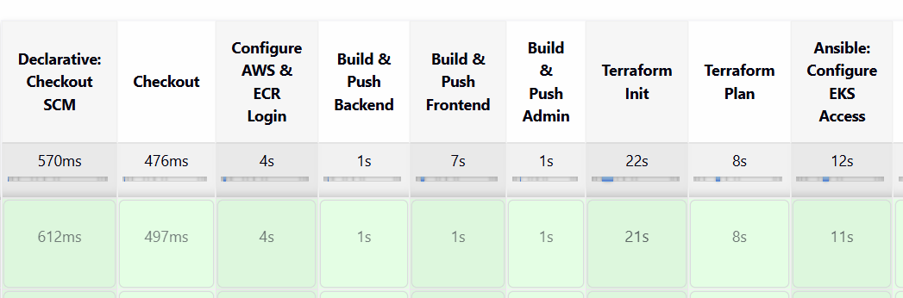

**S3 remote state bucket:**


**Amazon ECR repositories:**

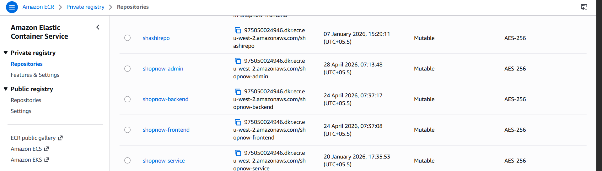

**VPC resource map (eu-west-2):**

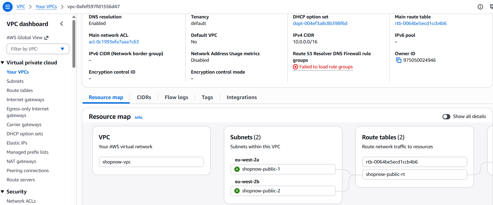

---

### Sprint 3 — Configuration Management (Ansible)

Three idempotent playbooks target `hosts: jenkins` in `ansible/inventory.ini`.

| Playbook | What it does |
|---|---|
| `01-install-dependencies.yml` | yum installs git/docker/python3, enables Docker, adds jenkins to docker group, installs AWS CLI v2, kubectl v1.28, Terraform v1.6.4, Ansible via pip3 |
| `02-configure-eks-access.yml` | Creates `/var/lib/jenkins/.kube/`, runs `aws eks update-kubeconfig`, creates `shopnow` namespace, installs AWS Load Balancer Controller via Helm |
| `03-deploy-monitoring.yml` | Applies Prometheus + Grafana manifests, waits for rollout, prints port-forward instructions |

**Ansible playbook successful run in Jenkins:**

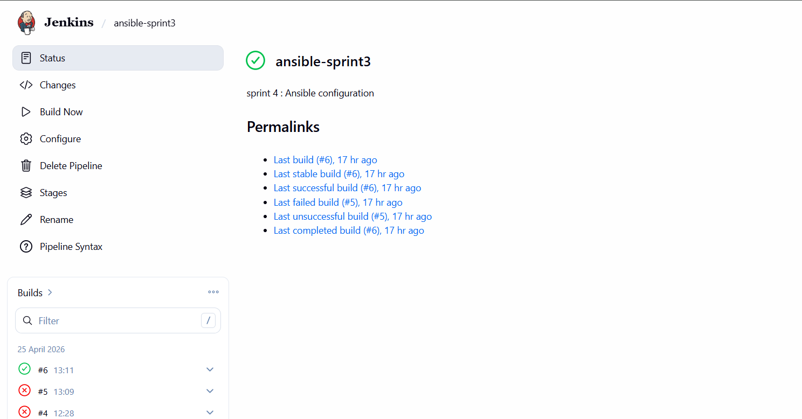

---

### Sprint 4 — Kubernetes Deployment

All manifests live in `k8s/` and are applied by the Jenkins pipeline.

**Key design decisions:**

- **MongoDB** uses `emptyDir: {}` storage (no EBS CSI driver required). Data resets on pod restart — suitable for demo/dev.
- **Frontend service** uses `type: LoadBalancer` — Kubernetes cloud controller provisions a Classic ELB automatically. No AWS Load Balancer Controller required.
- **nginx config** is delivered via a **ConfigMap** mounted as a volume — survives pod restarts and rolling updates without rebuilding the image.
- **HPA** uses `autoscaling/v2` with both CPU (60%) and Memory (70%) metrics, and separate scale-up/scale-down stabilization windows.

**EKS cluster active in AWS Console:**

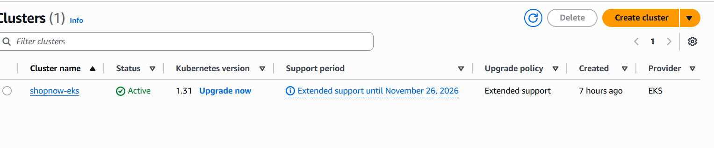

**Pods running in `shopnow` namespace:**

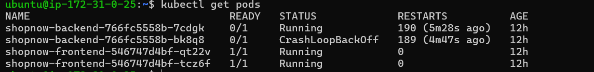

**EC2 instances (Jenkins + EKS nodes):**

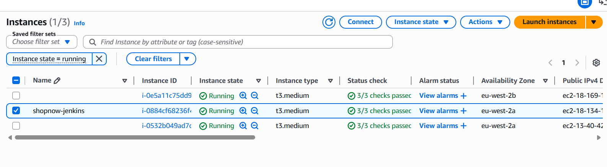

**Autoscaling configuration:**

```yaml
# backend-hpa: min 2, max 8 pods
scaleUp:   stabilizationWindowSeconds: 60,  2 pods per 60s
scaleDown: stabilizationWindowSeconds: 300, 1 pod per 120s

# frontend-hpa: min 2, max 6 pods
scaleUp:   stabilizationWindowSeconds: 60,  2 pods per 60s
scaleDown: stabilizationWindowSeconds: 300, 1 pod per 120s
```

---

### Sprint 5 — Monitoring & Observability

Prometheus uses a `ClusterRole` to scrape metrics from all pods annotated with:
```yaml
prometheus.io/scrape: "true"
prometheus.io/port:   "5000"
prometheus.io/path:   "/metrics"
```

| Component | Image | Port | Storage |
|---|---|---|---|
| Prometheus | `prom/prometheus:v2.47.0` | 9090 | emptyDir, 15d retention |
| Grafana | `grafana/grafana:latest` | 3000 | emptyDir |

**Access (port-forward):**
```bash
kubectl port-forward svc/prometheus-service 9090:9090 -n shopnow
kubectl port-forward svc/grafana-service    3000:3000 -n shopnow
```

---

## CI/CD Pipeline (All 15 Stages)

```
 #1 Checkout
 #2 Configure AWS & ECR Login
 #3 Build & Push Backend    ──┐
 #4 Build & Push Frontend     ├── Sequential (conserves memory)
 #5 Build & Push Admin      ──┘
 #6 Terraform Init
 #7 Terraform Plan
 #8 Ansible: Configure EKS Access
 #9 Update kubeconfig
#10 Deploy to EKS
#11 Wait for Rollout
#12 Smoke Test               (polls 30× for ELB hostname → curl /api/health)
#13 Deploy Monitoring
#14 Ansible: Configure Monitoring
#15 Deployment Summary

post:
  success → echo "shopNow is live"
  failure → kubectl rollout undo (backend + frontend + admin)
  always  → docker rmi cleanup
```

**Build #14 — All stages green (first half):**

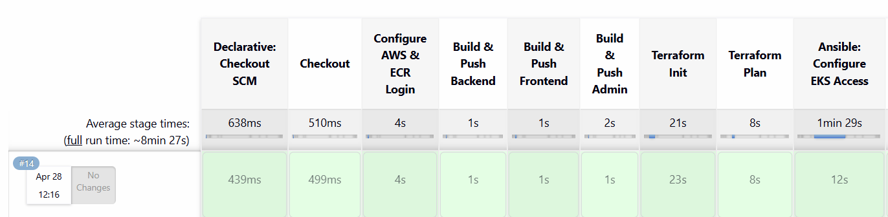

**Build #14 — All stages green (second half + Smoke Test):**

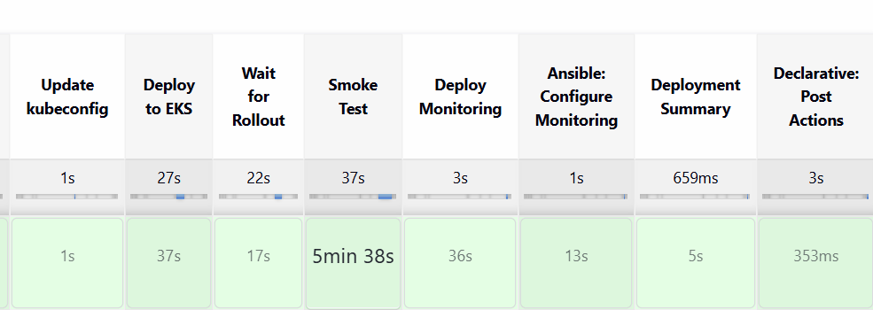

**Jenkins environment variables:**

| Variable | Value |
|---|---|
| `AWS_REGION` | `eu-west-2` |
| `AWS_ACCOUNT_ID` | `975050024946` |
| `ECR_BASE` | `975050024946.dkr.ecr.eu-west-2.amazonaws.com` |
| `EKS_CLUSTER` | `shopnow-eks` |
| `K8S_NAMESPACE` | `shopnow` |
| `KUBECONFIG` | `/var/lib/jenkins/.kube/config` |
| `IMAGE_TAG` | `${BUILD_NUMBER}` |

**Jenkins credentials required:**

| ID | Type | Usage |
|---|---|---|
| `aws-cred` | AWS Credentials | ECR login, EKS access, Terraform state |

---

## Kubernetes Workloads

| Workload | Kind | Replicas | Image | Service Type |
|---|---|---|---|---|
| backend | Deployment | 2 | `shopnow-backend:latest` | ClusterIP :5000 |
| frontend | Deployment | 2 | `shopnow-frontend:latest` | **LoadBalancer** :80 |
| admin | Deployment | 2 | `shopnow-admin:latest` | ClusterIP :80 |
| mongodb | StatefulSet | 1 | `mongo:6.0` | Headless (ClusterIP: None) |
| prometheus | Deployment | 1 | `prom/prometheus:v2.47.0` | ClusterIP :9090 |
| grafana | Deployment | 1 | `grafana/grafana:latest` | ClusterIP :3000 |

**Resource limits:**

| Workload | CPU Request | CPU Limit | Memory Request | Memory Limit |
|---|---|---|---|---|
| backend | 100m | 500m | 128Mi | 256Mi |
| frontend | 50m | 200m | 64Mi | 128Mi |
| prometheus | 100m | 500m | 256Mi | 512Mi |

---

## Monitoring & Observability

Prometheus is configured with a `ClusterRole` that grants `get/list/watch` on `nodes`, `services`, `endpoints`, and `pods`, plus access to `/metrics` non-resource URLs.

```bash
# Verify Prometheus targets
kubectl port-forward svc/prometheus-service 9090:9090 -n shopnow
# Open http://localhost:9090/targets

# Grafana dashboards
kubectl port-forward svc/grafana-service 3000:3000 -n shopnow
# Open http://localhost:3000  (add Prometheus as data source: http://prometheus-service:9090)
```

**Grafana — container CPU usage dashboard:**

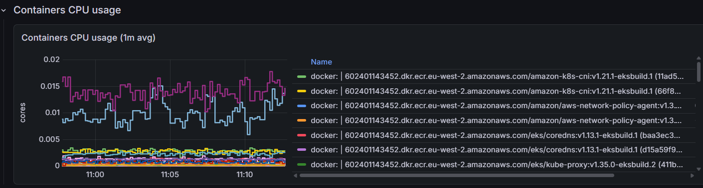

---

## Issues & Fixes

| Problem | Root Cause | Fix Applied |
|---|---|---|
| ALB Ingress not reconciling | IMDSv2 hop limit = 1 blocked pod access to EC2 metadata | Switched frontend-service to `type: LoadBalancer` (Classic ELB, no ALB controller needed) |
| Products not loading in frontend | React built with `/aryan/api` base URL but nginx had no `/aryan/api/` proxy block | Added `location /aryan/api/` proxy block *before* the `/aryan/` rewrite location in nginx |
| nginx fix lost after pod restart | Config patched in running container via `kubectl exec` — not persisted | Delivered nginx config via a **ConfigMap** mounted as a volume — survives rolling updates |
| Terraform state conflict | Concurrent applies racing on local state | S3 backend with DynamoDB conditional-write locking |
| Docker permission denied | `jenkins` user not in `docker` group | Ansible `user` task adds jenkins to docker group |

---

## Author

**Prateek Tiwari**

- GitHub: [@Prateekdevops-619](https://github.com/Prateekdevops-619)
- Repository: [github.com/Prateekdevops-619/shopNow](https://github.com/Prateekdevops-619/shopNow)

---

<p align="center">
  <sub>Built with ❤️ using Terraform · Ansible · Jenkins · Docker · Kubernetes · Prometheus · Grafana on AWS EKS</sub>
</p>
